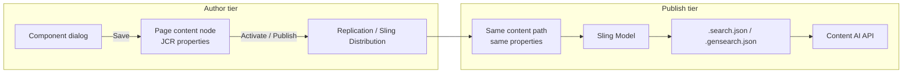

# Design: ContentAI Supported Search — Author Dialog & Multi-Source Configuration

**Date:** 2026-07-13  
**Status:** Draft — for review before implementation  
**Ticket:** [GRANITE-70028](https://jira.corp.adobe.com/browse/GRANITE-70028)  
**Parent spec:** `docs/superpowers/specs/2026-07-06-search-gensearch-semantic-search-components-design.md`  
**Branch:** `semantic-gensearch-components`

---

## 1. Summary

Enhance the **ContentAI Supported Search** author dialog so authors configure search scope and visitor UX without typing raw index names. Replace the free-text **Content Source** field with:

1. A **content source type** dropdown (default `ACQUISITION`)
2. A **multi-select** list of content sources populated from Content AI `GET /content-sources`
3. New visitor-facing controls: **GenSearch toggle visibility** and **GenSearch error fallback**
4. Backend support for **parallel multi-source search with merged results** (decision **A**)

This spec covers author dialog, JCR data model, runtime behavior on publish, and how configuration flows from author to publish. **No implementation** until this spec is approved.

---

## 2. Decisions locked (from product discussion)

| # | Decision | Notes |
|---|----------|-------|
| 1 | **Multi-source search = parallel fan-out + merge** | Each selected index queried independently; results merged server-side |
| 2 | **Index picker source = `GET /content-sources` only** | Teammate confirmed: do not use `/indexes`; `/content-sources` is the list API |
| 3 | **Default content source type = `ACQUISITION`** | Matches Content AI team guidance for public anonymous search |
| 4 | **Add `genSearchToggleVisible`** | Controls whether visitor sees the GenSearch **toggle checkbox** (not summary directly — see §6) |
| 5 | **Add `genSearchErrorFallback`** | Default **`RESULTS_ONLY`** (quiet on GenSearch failure) |
| 6 | **Public-site scope unchanged** | Still `X-Api-Key`, public indexes only; no Bearer/ACL at query time |
| 7 | **Primary source = auto first selected** | No author picker; `primaryContentSource` derived at save/read from first `contentSources[]` entry |
| 8 | **Content source type dropdown shows all types** | `ACQUISITION`, `AEM_AUTHOR`, `AEM_PUBLISH`, `CUSTOM` — filter list API results by selected type |

---

## 3. Background — current v1 state

| Area | Today |
|------|-------|
| Dialog | Single required text field `contentSource` |
| Model | `contentSource`, `resultsSize`, `genSearchEnabledByDefault`, `placeholder`, `disclaimerText` |
| API client | Sends single `contentSource.name`; omits `contentSource.type` |
| GenSearch toggle | Always rendered; default ON via `genSearchEnabledByDefault` |
| GenSearch error | Fixed: show error panel + retry; results list unaffected |
| Index discovery | Manual (author must know name, e.g. `aem-live`) |

---

## 4. Author → publish: how configuration propagates

Understanding this is critical for dialog design — **the dialog writes JCR properties on the page content node; publish reads those properties at runtime.**

### 4.1 What travels with replication (Activate / Publish)

When an author **activates** or **publishes** a page (or uses Manage Publication):

```
/content/{site}/.../page/jcr:content/root/.../contentaisearch   ← component instance node
```

All **component instance properties** stored on that node are replicated to publish, for example:

- `contentSourceType`
- `contentSources` (multi-value)
- `primaryContentSource`
- `genSearchEnabledByDefault`
- `genSearchToggleVisible`
- `genSearchErrorFallback`
- `resultsSize`, `placeholder`, `disclaimerText`, `id`

**Publish behavior:** At request time, the Sling Model reads these properties from the replicated resource. Servlets use the model — **no author-tier call is needed on publish to resolve dialog choices.**



### 4.2 What does NOT propagate via page replication

| Item | How it reaches publish |
|------|------------------------|
| **Component code** (`/apps/core/wcm/components/contentaisearch/...`) | **Content package** deploy (Cloud Manager pipeline or `mvn -PautoInstallPackagePublish`) |
| **Java bundle** (servlets, `ContentAIClient`) | **Bundle** deploy with core package |
| **OSGi** (`ContentAIConfig.apiKey`, timeouts) | **Cloud Manager env secret** + OSGi config on **each** tier; not part of page content |
| **Dialog datasource** (`GET /content-sources` at edit time) | **Author-only** — runs when dialog opens; results are persisted as selected property values |

### 4.3 Local SDK (4502 / 4503)

Same model as production, with manual steps documented in manual QA:

1. Deploy packages to **both** author and publish (`autoInstallPackage` + `autoInstallPackagePublish`)
2. Configure OSGi on **both** tiers (or rely on examples config package + runtime override)
3. Enable replication agent: author → `http://localhost:4503/bin/receive`
4. **Activate** the test page on author → properties appear on publish content node

### 4.4 Implication for list API datasource

- The **datasource servlet** calls Content AI **only on author** (when the dialog loads or type filter changes).
- Authors pick source **names** from the API response; **names are saved as JCR strings** on the component node.
- Publish never calls `/content-sources` — it only uses the stored names in search/gensearch requests.
- If a source is deleted server-side after publish, runtime calls fail gracefully (502/empty); dialog validation should warn on re-open.

> **Note:** FluffyJaws was unavailable during spec drafting (connection timeout). Propagation model above aligns with standard AEM replication and our manual QA plan (`§3.4 Replication`).

---

## 5. Content AI list API — live sample (2026-07-13)

### 5.1 Endpoint (confirmed with Content AI team)

**Use `GET /content-sources` only** for the author dialog datasource. Do not call `/indexes`.

| Endpoint | Status |
|----------|--------|
| `GET {baseUrl}/content-sources` | **Canonical** — full metadata (`name`, `description`, `type`, `config.access.public`, …) |
| `GET {baseUrl}/indexes` | **Out of scope** — legacy/minimal (`name` only); not used by this component |

`{baseUrl}` must match the environment’s experimental path (e.g. `contentai-expires-20251231` or `aemcontentai-expires-20261231` per deployment). Resolved via `ContentAIClientImpl.resolveBaseUrl()`.

### 5.2 Request

```
GET {baseUrl}/content-sources
Headers: X-Api-Key: {client-id}, Accept: application/json
```

`{baseUrl}` = same resolution as `ContentAIClientImpl.resolveBaseUrl()`.

### 5.3 Response schema (observed on E2E bucket, 24 items)

**Root:**

```json
{ "items": [ /* ContentSource */ ] }
```

**Each item — fields to use in dialog:**

| Field | Type | Dialog use |
|-------|------|------------|
| `name` | string | **Primary option value** (saved to `contentSources[]`) |
| `id` | string (if present) | **Fallback option value** when `name` is blank |
| `description` | string \| null | **Option label suffix** — see §5.4 label rules |
| `type` | string | Filter by author-selected `contentSourceType` (`ACQUISITION`, …) |
| `config.access.public` | boolean | **Filter:** only list sources where `true` for this public component |
| `createdAt`, `updatedAt`, `managedBy`, `config` | — | Not shown in dropdown; not persisted on component |

**Example (`aem-live`):**

```json
{
  "name": "aem-live",
  "description": null,
  "type": "ACQUISITION",
  "createdAt": "2026-07-06T07:50:25.474Z",
  "updatedAt": "2026-07-06T07:50:25.474Z",
  "managedBy": "ACQUISITION",
  "config": {
    "vectorSpaces": { "semantic-vector": { "description": "...", "default": true } },
    "lexicalSpaces": { "fulltext": { "description": "...", "default": true, "fields": [ "..."] } },
    "access": { "public": true }
  }
}
```

**Legacy `/indexes`:** not used by this component (teammate confirmation). Environments that only expose `/indexes` must enable `/content-sources` or upgrade Content AI provisioning.

### 5.4 Datasource filtering and dropdown labels

#### Filtering

1. Call **`GET /content-sources`** with configured `X-Api-Key`.
2. Filter `items[]` where `item.type === dialog.contentSourceType` (author-selected; default `ACQUISITION`).
3. For this public component: require `item.config.access.public === true` when that field is present.
4. Multi-select Coral UI bound to datasource.
5. On save: persist `contentSources[]` (index **names** only); set `primaryContentSource = contentSources[0]` automatically.

#### Index name (option `value`)

Resolve the index name stored in JCR:

```
indexName = first non-blank of item.name, item.id
```

Persist **`indexName`** to `contentSources[]`. Search/gensearch requests use `contentSource.name = indexName`.

#### Display label (option `text`)

Build the author-visible label in the datasource servlet:

| Condition | Label |
|-----------|-------|
| `description` is `null`, empty, or whitespace-only | **`{indexName}`** only |
| `description` has text | **`{indexName} — {truncatedDescription}`** |

**Description truncation:**

- Constant: `DESCRIPTION_LABEL_MAX_LENGTH = 80` (characters).
- Trim leading/trailing whitespace on description before formatting.
- If `description.length <= 80`: append full description after ` — `.
- If `description.length > 80`: append first 80 characters + `...` (ellipsis).

**Examples:**

| `name` | `description` | Dropdown label |
|--------|---------------|----------------|
| `aem-live` | `null` | `aem-live` |
| `aem-live` | `""` | `aem-live` |
| `hotels-demo` | `Demo hotel content index` | `hotels-demo — Demo hotel content index` |
| `hotels-demo` | `(91+ char long text…)` | `hotels-demo — First eighty characters of the description text here shown truncated...` |

Implementation note: set Granite `DataSource` option `value` = index name, `text` = formatted label. HTML-escape `text` for safe display in Coral select.

### 5.5 Search/gensearch request bodies (unchanged contract)

Per parent spec, search/gensearch accept:

```json
"contentSource": { "name": "aem-live", "type": "ACQUISITION" }
```

`type` defaults to `ACQUISITION` if omitted. Other values: `AEM_AUTHOR`, `AEM_PUBLISH`, `CUSTOM`.

---

## 6. Author dialog — proposed fields

### Tab: Content scope

| Field | Widget | Property | Required | Default | Notes |
|-------|--------|----------|----------|---------|-------|
| Content source type | `select` | `contentSourceType` | Yes | `ACQUISITION` | Options: `ACQUISITION`, `AEM_AUTHOR`, `AEM_PUBLISH`, `CUSTOM` — filters list API |
| Content sources | `select` (multiple) | `contentSources` | Yes (≥1) | — | Datasource: `GET /content-sources`; labels per §5.4 |

**Not in dialog:** `primaryContentSource` — **auto-set to `contentSources[0]`** on save (and recomputed on read if missing). Used for GenSearch only.

**Help text (retain security message):** Selected sources must be **public** Content AI indexes of published content (`config.access.public = true`). Content AI does not evaluate AEM ACLs. Non-ACQUISITION types are selectable but intended for future/co-innovation scenarios — warn in help text when type ≠ `ACQUISITION`.

**Legacy migration:** If `contentSources` empty but legacy `contentSource` string set → treat as single-element array; copy to `contentSources` on read (model), optional dialog migration on save.

### Tab: Search behavior

| Field | Widget | Property | Default | Notes |
|-------|--------|----------|---------|-------|
| Number of results | `numberfield` | `resultsSize` | `10` | **Global** limit after merge |
| Placeholder text | `textfield` | `placeholder` | — | Existing |
| Search mode | `select` | `searchMode` | `HYBRID` | **v1.1 optional** — see §8 |

### Tab: Generative search (visitor UX)

| Field | Widget | Property | Default | Notes |
|-------|--------|----------|---------|-------|
| Show GenSearch toggle to visitors | `checkbox` | `genSearchToggleVisible` | `true` | When `false`, checkbox hidden; fixed ON/OFF from `genSearchEnabledByDefault` |
| GenSearch enabled by default | `checkbox` | `genSearchEnabledByDefault` | `true` | Default toggle state when visible; fixed behavior when toggle hidden |
| GenSearch error fallback | `select` | `genSearchErrorFallback` | **`RESULTS_ONLY`** | See below |
| Disclaimer text | `textarea` | `disclaimerText` | — | Existing |

#### `genSearchErrorFallback` values

| Value | Visitor behavior when `.gensearch.json` fails |
|-------|-----------------------------------------------|
| `RESULTS_ONLY` | Hide summary **and** error UI; results list unchanged (**default**) |
| `SHOW_ERROR` | Show error message + retry button; results list unchanged (current v1 behavior) |
| `SHOW_ERROR_MESSAGE` | Show inline message only (no retry button) |

Results list errors remain independent in all modes.

#### `genSearchToggleVisible` — what it controls

This property controls whether the **visitor-facing checkbox** (“Show AI-generated summary”) is rendered — **not** the summary section directly.

| `genSearchToggleVisible` | `genSearchEnabledByDefault` | Visitor experience |
|--------------------------|----------------------------|--------------------|
| `true` | `true` | Toggle shown, default ON; visitor can turn summary off |
| `true` | `false` | Toggle shown, default OFF; visitor can turn summary on |
| `false` | `true` | No toggle; GenSearch **always** runs |
| `false` | `false` | No toggle; GenSearch **never** runs (results only) |

---

## 7. Runtime — multi-source search (decision A)

### 7.1 Search (results list)

For component with `contentSources = ["aem-live", "marketing-blog"]`:

1. Servlet validates query (`q` param, max 512 chars).
2. For **each** source in parallel:
   - `POST /content-sources/search` with `{ contentSource: { name, type: contentSourceType }, query, queryOptions }`
3. **Merge** result sets:
   - Dedupe by `result.id` (keep highest `score`)
   - Sort by `score` descending
   - Truncate to `resultsSize` (global limit)
4. Return merged `ContentSourceSearchResult` JSON.

**Pagination:** v1 merged response omits meaningful `cursor` (multi-source cursors differ). Document as limitation; defer "load more" to v2.

### 7.2 GenSearch (generative summary)

- Uses **`primaryContentSource`** = first entry in `contentSources[]` (auto-derived; persisted on save for stable replication).
- No multi-source GenSearch in v1.

### 7.3 API surface changes

| Layer | Change |
|-------|--------|
| `ContentAIClient` | Add `listContentSources()` → `GET /content-sources`; pass `type` on search/gensearch |
| `ContentAISearchResultsServlet` | Multi-source orchestration + merge |
| `ContentAIGenSearchServlet` | Use `primaryContentSource` |
| `ContentAISupportedSearch` model | New getters; deprecate single `getContentSource()` with fallback |

---

## 8. Deferred / optional (out of v1.1 scope unless approved)

| Feature | Reason to defer |
|---------|-----------------|
| Search mode (hybrid / vector / fulltext) | Query shape hardcoded today; adds complexity |
| Vector/fulltext boost fields | Author tuning; needs relevance testing |
| Streaming GenSearch | Parent spec defers SSE |
| Caching list API response | Author dialog only; short TTL optional later |

---

## 9. Implementation architecture (high level)

### 9.1 Author-only datasource servlet

Pattern: `ModelDataSourceServlet` / `AbstractDataSourceServlet` in `bundles/core`.

```
/apps/core/wcm/components/contentaisearch/v1/datasources/contentsources
  → ContentSourcesDataSourceServlet
  → ContentAIClient.listContentSources()
  → filter by contentSourceType + config.access.public
  → build label: name/id + optional truncated description (§5.4)
  → Granite DataSource options (value=indexName, text=formattedLabel)
```

Dialog `select` with `multiple="{Boolean}true"` and `datasource` child.

### 9.2 Files touched (estimate)

| Module | Files |
|--------|-------|
| `content/.../_cq_dialog/.content.xml` | Dialog tabs + fields |
| `content/.../contentaisearch.html` | New data attributes for JS |
| `content/.../contentaisearch.js` | Toggle visibility + error fallback |
| `bundles/core/.../ContentAISupportedSearch.java` | New property constants + getters |
| `bundles/core/.../ContentAISupportedSearchImpl.java` | Read multi-value + legacy fallback |
| `bundles/core/.../ContentAIClient.java` | `listContentSources()`, type param |
| `bundles/core/.../ContentAIClientImpl.java` | HTTP for `/content-sources`; type in search body |
| `bundles/core/.../ContentAISearchResultsServlet.java` | Merge orchestration (or new service) |
| `bundles/core/.../ContentSourcesDataSourceServlet.java` | New |
| Tests | Model, client, servlet, datasource, JS |

---

## 10. Security & validation

| Rule | Enforcement |
|------|-------------|
| Public indexes only | Datasource filters; dialog validator rejects non-public if metadata available |
| No API key in dialog/browser | Datasource runs server-side only |
| ACQUISITION default | Type dropdown default + help text |
| Multi-source still one API key | Same OSGi config; no new secrets |

---

## 11. Testing plan (spec-level)

| Test | Type |
|------|------|
| Datasource returns options from mocked `/content-sources` | Unit |
| Filter by type + public | Unit |
| Legacy `contentSource` → `contentSources` fallback | Unit |
| Parallel search merge + dedupe + limit | Unit |
| GenSearch uses primary source | Unit |
| `genSearchToggleVisible=false` hides toggle in HTL/JS | Unit + manual |
| Each `genSearchErrorFallback` mode | JS unit + manual |
| Activate page on author → properties on publish node | Manual SDK |
| E2E search on publish with multi-source config | Manual |

---

## 12. Resolved questions (2026-07-13)

| # | Question | Resolution |
|---|----------|------------|
| 1 | List API | **`GET /content-sources` only** (teammate); label rules in §5.4 |
| 2 | Primary source UX | **Auto first selected** — no dialog field |
| 3 | Non-ACQUISITION types | **Show in type dropdown**; filter list by selected type |
| 4 | GenSearch error default | **`RESULTS_ONLY`** (quiet) |
| 5 | Merge `totalResults` | **Count after merge** (deduped list size); omit or zero `cursor` in v1 |

---

## 13. Approval checklist

- [ ] Multi-source merge behavior (§7) approved
- [ ] Dialog field set (§6) approved
- [ ] Author → publish model (§4) understood / confirmed
- [ ] List API = `/content-sources` (§5) approved
- [ ] Open questions resolved (§12)
- [ ] Ready for implementation plan (`writing-plans` skill)

---

## 14. References

- `docs/superpowers/specs/2026-07-06-search-gensearch-semantic-search-components-design.md`
- `docs/superpowers/2026-07-09-contentai-supported-search-session-context.md` (§7 architecture decisions)
- `docs/superpowers/plans/2026-07-09-contentai-supported-search-manual-qa.md` (update `/indexes` → `/content-sources` when implementing)
- OpenAPI: `developer.adobe.com/.../api/experimental/contentai/` (authoritative contract)
